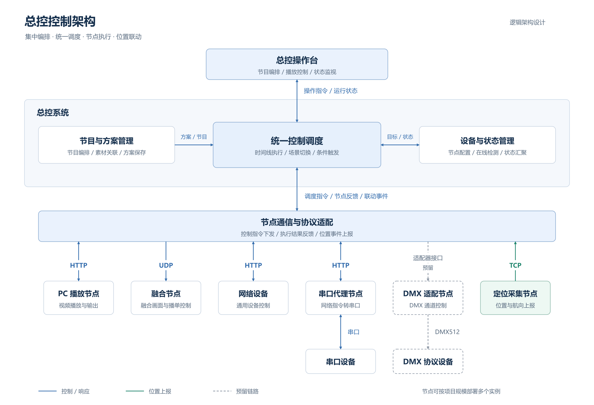

# 总控控制架构

[draw.io 可编辑源文件](control-architecture.drawio) · [SVG 矢量图](control-architecture.svg) · [PNG 预览图](control-architecture.png)

图中按“总控操作台 → 总控系统 → 节点通信与协议适配 → 执行与采集节点”组织逻辑架构，表示总体设计和节点通信关系。

- 总控系统负责节目与方案管理、统一控制调度、设备与状态管理。
- PC 播放节点和网络设备通过 HTTP 接收控制；融合节点通过 UDP 接收指令。
- 串口设备经 HTTP 接入串口代理，再由代理通过串口控制。
- 定位采集节点通过 TCP 上报位置和航向，用于定位展示与条件联动。
- DMX 适配节点连接支持 DMX 协议的各类设备；虚线表示预留链路。

在 draw.io 中直接打开 `.drawio` 文件即可编辑所有模块、文字和连线。该图为逻辑设计图，不表示当前所有设备链路均已完成现场接入。
