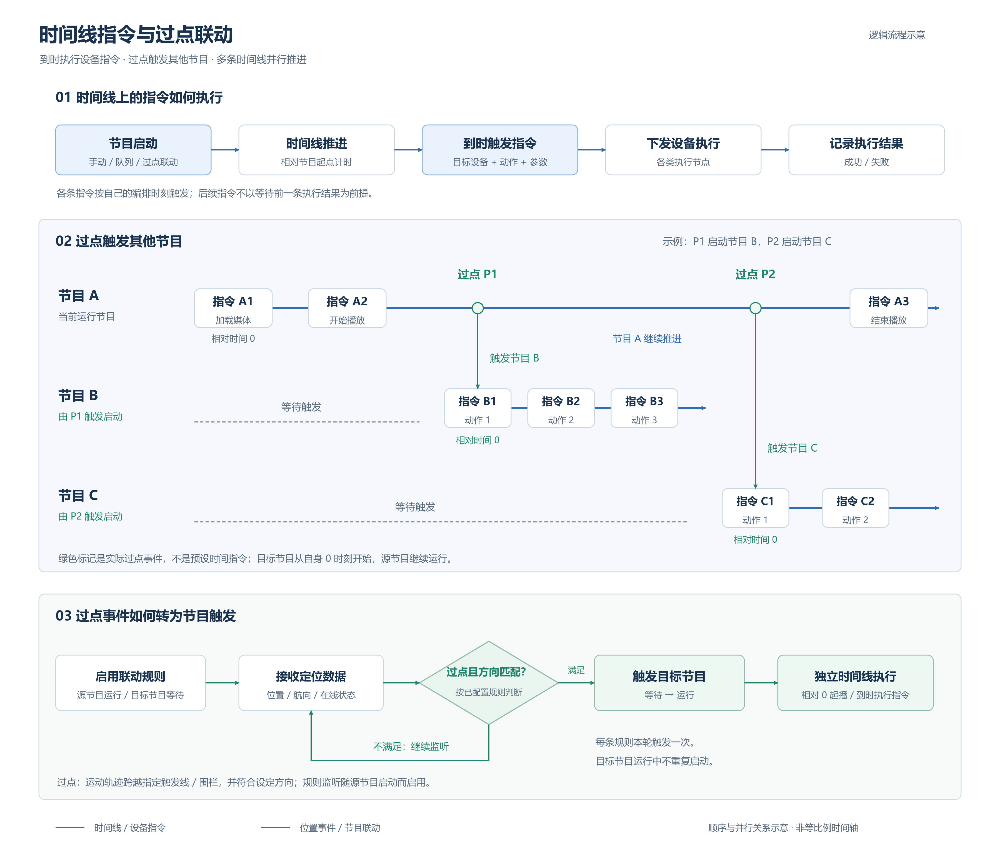

# 时间线指令与过点联动

[draw.io 可编辑源文件](timeline-trigger-flow.drawio) · [SVG 矢量图](timeline-trigger-flow.svg) · [PNG 预览图](timeline-trigger-flow.png)

该图表示抽象的业务设计，分为指令执行、节目并行示意和过点判定三部分，不包含界面框架、具体类名及调试行为。

- **时间线指令**：节目启动后按相对时间推进；各指令在编排时刻触发，包含目标设备、动作和参数。执行结果回写状态，后续指令按各自时刻触发。
- **过点规则**：源节目启动时启用已配置的规则，使可触发的目标节目进入等待状态；结合连续位置、航向及在线状态，判断运动轨迹是否跨过指定触发线或围栏并满足方向要求。
- **联动启动**：示例中节目 A 过点 P1 后启动节目 B，过点 P2 后启动节目 C。每个目标节目从自身 0 时刻开始执行，源节目继续运行。
- **重复触发控制**：每条规则本轮触发后关闭，重新启动源节目时重新启用；运行中的目标节目不重复启动。

图中 P1、P2 是位置事件，不是时间线上的预设秒数，也不是设备指令。横向位置只表示先后与并行关系，不按时间比例绘制。
